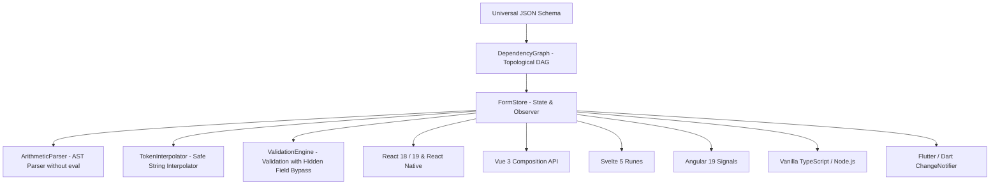

# 🚀 @dynamic-form

<div align="center">

[](./LICENSE)
[](https://www.typescriptlang.org/)
[](#)
[](#-13-technology-ecosystem)
[](./CONTRIBUTING.md)

**Universal, Declarative, and Typed Engine for Complex Dynamic Forms**  
*Built for maximum performance, zero UI coupling, and full interoperability across Web, Mobile, and Backend.*

🌐 **[ English ](./README.md)** • **[ Português (Brasil) ](./README.pt-BR.md)**

[Getting Started](#-quick-start) • [The 10 Rules](#-the-10-dynamicfield-rules) • [Engine Architecture](#-engine-architecture) • [Ecosystem Examples](#-13-technology-ecosystem) • [Contributing](./CONTRIBUTING.md)

</div>

---

## 🌟 Why @dynamic-form?

Enterprise-scale forms frequently suffer from:
- Circular dependencies and infinite re-render loops.
- Extreme coupling between business logic and UI component libraries.
- Insecure use of `setTimeout` or `eval()` to resolve cascading calculations.
- Lack of a universal contract between backends emitting schemas and frontends rendering them.

**@dynamic-form** solves these challenges through a computer science-driven foundation and strict separation of concerns:

1. **Directed Acyclic Graph (DAG)**: Topological dependency resolution (`DependencyGraph`) guaranteeing instant, deterministic, and glitch-free event propagation.
2. **Zero UI Coupling in Core**: `@dynamic-form/core` is pure TypeScript compiled to ESM and CommonJS, running identically in browsers, Node.js/Bun/Deno runtimes, React Native, and web workers.
3. **Arithmetic AST Parser (`ArithmeticParser`)**: Recursive descent lexical and syntactic parser for mathematical formulas without `eval()` or `new Function()`, featuring operator precedence, floating-point precision, dynamic field references, and step-based rounding.
4. **Fine-Grained Reactive Subscriptions (Observer Pattern)**: `FormStore` enables both global state observations and atomic per-field subscriptions (`subscribeField`), preventing unnecessary component re-renders.
5. **Universal JSON Schema v1.0**: Formal specification [`spec/dynamic-form.schema.json`](./spec/dynamic-form.schema.json) compatible with JSON Schema Draft 7 / 2020-12 for dynamic validation and generation across any backend language.

---

## 🏗️ Engine Architecture



---

## 📋 The 10 `DynamicField` Rules

All canonical implementations strictly support the 10 declarative dependency rules:

| # | Rule | Purpose | Configuration Example |
|---|---|---|---|
| **1** | `dependentFields` | Conditional visibility based on other field values | `dependentFields: { person_type: 'PF' }` |
| **2** | `disabledFields` | Conditional disabling of inputs | `disabledFields: { supplier_category: 'restricted' }` |
| **3** | `disabledFieldsCondition` | Logical operator for disabling (`and` \| `or`) | `disabledFieldsCondition: 'and'` |
| **4** | `reloadFields` | Triggers dynamic reload of options/catalogs | `reloadFields: ['city_id']` |
| **5** | `autoSetFields` | Automated field population from selected record | `autoSetFields: [{ target: 'unit_price', from: 'price' }]` |
| **6** | `clearedFields` | Clears dependent fields when origin value changes | `clearedFields: ['city_id']` |
| **7** | `clearedFieldsChanged` | Forces immediate clearance when value is altered | `clearedFieldsChanged: true` |
| **8** | `requiredFields` | Conditional dynamic requirement rules | `requiredFields: { supplier_category: 'vip', quantity: 5 }` |
| **9** | `requiredRule` | Logical operator for requirement evaluation | `requiredRule: 'and'` |
| **10** | `calcFields` | Real-time mathematical expression evaluation via AST | `calcFields: 'quantity * unit_price * (1 - discount / 100)'` |

---

## 📦 Monorepo Structure

```
dynamic-form/
├── spec/                               # 🌐 Universal Specification (JSON Schema v1.0)
│   ├── dynamic-form.schema.json        # Formal JSON Schema Draft 7 / 2020-12
│   └── README.md                       # Validation guide for Go, Java, .NET, and Python
├── packages/
│   ├── core/                           # 🧠 @dynamic-form/core (Pure TS, zero UI dependencies)
│   │   ├── src/graph/                  # Directed Acyclic Graph (DAG)
│   │   ├── src/expression/             # Arithmetic AST Parser & Token Interpolator
│   │   ├── src/store/                  # Reactive FormStore
│   │   └── src/validation/             # Dynamic validation engine
│   └── react/                          # ⚛️ @dynamic-form/react (Hooks & Components)
│       ├── src/hooks/                  # useDynamicForm & useDynamicField
│       └── src/components/             # DynamicFormProvider & DynamicFormRoot
├── examples/                           # 🚀 13 Canonical Implementations by Tech Stack
│   ├── form-schema.json                # Shared universal schema covering all 10 rules
│   ├── react-web/                      # React 19 + TypeScript + Vite + Tests
│   ├── react-native/                   # React Native (Expo) + Paper + Tests
│   ├── angular/                        # Angular 19 + Signals + Tests
│   ├── vue/                            # Vue 3 + Composition API + Tests
│   ├── svelte/                         # Svelte 5 + Runes ($state) + Tests
│   ├── typescript-vanilla/             # Native DOM + Headless Node.js CLI + Tests
│   ├── flutter/                        # Flutter / Dart + Material 3 + Tests
│   ├── go/                             # Go HTTP server with schema validation
│   ├── java-spring/                    # Java 21 / Spring Boot 3 REST API
│   ├── dotnet-csharp/                  # C# / .NET 8 Minimal API
│   ├── python/                         # FastAPI + Pydantic v2
│   ├── swift/                          # Native iOS SwiftUI with @Observable macro
│   └── kotlin/                         # Native Android Jetpack Compose with StateFlow
├── CONTRIBUTING.md                     # Contribution guidelines
├── LICENSE                             # MIT License
└── README.md                           # Main documentation
```

---

## ⚡ Quick Start

### 1. Headless Core (`@dynamic-form/core`)

```bash
npm install @dynamic-form/core
```

```typescript
import { FormStore, type DynamicFormSchema } from '@dynamic-form/core';

const schema: DynamicFormSchema = {
  structure: [
    [
      {
        component: 'select',
        attr: {
          name: 'person_type',
          label: 'Type',
          options: [{ label: 'Individual', value: 'INDIVIDUAL' }, { label: 'Company', value: 'COMPANY' }]
        },
        clearedFieldsChanged: true,
        clearedFields: ['tax_id', 'company_id']
      }
    ],
    [
      {
        component: 'input',
        attr: { name: 'tax_id', label: 'Tax ID' },
        dependentFields: { person_type: 'INDIVIDUAL' }
      },
      {
        component: 'input',
        attr: { name: 'company_id', label: 'Company Registration' },
        dependentFields: { person_type: 'COMPANY' }
      }
    ]
  ]
};

const store = new FormStore({ schema, initialValues: { person_type: 'INDIVIDUAL' } });

// Reactive subscription to state transitions
store.subscribe((state) => {
  console.log('Current values:', state.values);
  console.log('Tax ID visible?', state.visibility.tax_id);
});

// Updates propagate instantly through the topological DAG
store.setValue('person_type', 'COMPANY');
```

---

### 2. React / Next.js (`@dynamic-form/react`)

```bash
npm install @dynamic-form/react @dynamic-form/core
```

```tsx
import React from 'react';
import { useDynamicForm } from '@dynamic-form/react';
import formSchema from './form-schema.json';

export function OrderApp() {
  const { values, errors, visibility, disabledState, setValue, submit, isSubmitting } = useDynamicForm({
    schema: formSchema,
    onSubmit: async (data) => {
      console.log('Validated payload:', data);
    }
  });

  return (
    <form onSubmit={(e) => { e.preventDefault(); submit(); }}>
      {/* Person Type Field */}
      <select
        value={values.person_type}
        onChange={(e) => setValue('person_type', e.target.value)}
      >
        <option value="INDIVIDUAL">Individual</option>
        <option value="COMPANY">Company</option>
      </select>

      {/* Conditional Reactive Field */}
      {visibility.tax_id !== false && (
        <div>
          <input
            placeholder="Tax ID Number"
            value={values.tax_id || ''}
            onChange={(e) => setValue('tax_id', e.target.value)}
          />
          {errors.tax_id && <span className="error">{errors.tax_id}</span>}
        </div>
      )}

      <button type="submit" disabled={isSubmitting}>Submit</button>
    </form>
  );
}
```

---

## 🌐 13-Technology Ecosystem

Each subdirectory in [`examples/`](./examples) contains standalone documentation, source code, and test suites:

| Technology | Type | Status | Framework / Pattern |
|---|---|:---:|---|
| **[React Web](./examples/react-web)** | Web Frontend | ✅ Ready | React 19 + Vite + `useSyncExternalStore` |
| **[React Native](./examples/react-native)** | Mobile | ✅ Ready | Expo 51 + React Native Paper + Metro Monorepo |
| **[Vue 3](./examples/vue)** | Web Frontend | ✅ Ready | Vue 3 + Composition API + `<script setup>` |
| **[Svelte 5](./examples/svelte)** | Web Frontend | ✅ Ready | Svelte 5 + Runes (`$state`, `$derived`) |
| **[Angular 19](./examples/angular)** | Web Frontend | ✅ Ready | Standalone Components + Reactive Signals |
| **[TypeScript Vanilla](./examples/typescript-vanilla)** | Web / CLI | ✅ Ready | Native DOM + Headless Node.js Script |
| **[Flutter](./examples/flutter)** | Mobile / Multi | ✅ Ready | Pure Flutter + `ChangeNotifier` + Material 3 |
| **[Go](./examples/go)** | Backend | ✅ Ready | Native HTTP server with schema validation |
| **[Java / Spring](./examples/java-spring)** | Backend | ✅ Ready | Spring Boot 3 + Bean Validation |
| **[C# / .NET 8](./examples/dotnet-csharp)** | Backend | ✅ Ready | Minimal API with `System.Text.Json` |
| **[Python](./examples/python)** | Backend | ✅ Ready | Async FastAPI with Pydantic v2 |
| **[Swift](./examples/swift)** | iOS Mobile | ✅ Ready | Native SwiftUI with `@Observable` macro |
| **[Kotlin](./examples/kotlin)** | Android Mobile | ✅ Ready | Jetpack Compose with `StateFlow` |

---

## 🧪 Automated Testing

To run unit and integration tests across the entire ecosystem:

```bash
# Core package tests
cd packages/core && npm test

# Example frontend suites
cd ../../examples/react-web && npm test
cd ../vue && npm test
cd ../svelte && npm test
cd ../angular && npm test -- --watch=false
cd ../typescript-vanilla && npm test
cd ../flutter && flutter test
```

---

## 🤝 Contributing

Contributions are warmly welcomed! Whether reporting a bug, proposing a new schema feature, or contributing a new framework example.

Please review our [CONTRIBUTING.md](./CONTRIBUTING.md) guide before submitting a Pull Request.

---

## 📄 License

Distributed under the **MIT** License. See [LICENSE](./LICENSE) for details.

---

<div align="center">
Built with passion for the open-source community by <strong>Create Pixels</strong>.
</div>
