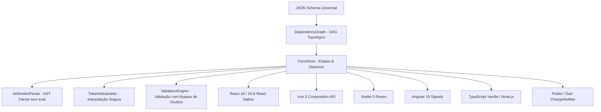

# 🚀 @dynamic-form

<div align="center">

[](./LICENSE)
[](https://www.typescriptlang.org/)
[](#)
[](#-ecossistema-de-13-tecnologias)
[](./CONTRIBUTING.md)

**Motor Universal, Declarativo e Tipado para Formulários Dinâmicos Complexos**  
*Desenvolvido para máxima performance, zero acoplamento de UI e interoperabilidade total entre Web, Mobile e Backend.*

🌐 **[ English ](./README.md)** • **[ Português (Brasil) ](./README.pt-BR.md)**

[Começar](#-início-rápido) • [As 10 Regras](#-as-10-regras-do-dynamicfield) • [Arquitetura](#-arquitetura-do-motor) • [Exemplos](#-ecossistema-de-13-tecnologias) • [Contribuir](./CONTRIBUTING.md)

</div>

---

## 🌟 Por que o @dynamic-form?

Formulários corporativos em grande escala frequentemente sofrem com:
- Dependências circulares e loops infinitos de re-renderização.
- Acoplamento extremo entre a lógica de negócio e componentes visuais de bibliotecas de UI específicas.
- Uso de `setTimeout` ou `eval()` inseguros para lidar com cálculos em cascata.
- Falta de um contrato universal entre backends que emitem schemas e frontends que os interpretam.

O **@dynamic-form** resolve estes desafios através de uma abordagem orientada a ciência da computação e separação estrita de responsabilidades:

1. **Grafo Acíclico Dirigido (DAG)**: Resolução topológica de dependências entre campos (`DependencyGraph`), garantindo propagação instantânea e determística de eventos.
2. **Zero Acoplamento de UI no Core**: O `@dynamic-form/core` opera em TypeScript puro compilado para ESM e CommonJS, rodando de forma idêntica no navegador, em servidores Node.js/Bun/Deno, no React Native e em workers.
3. **Parser Aritmético com AST (`ArithmeticParser`)**: Descida recursiva léxica e sintática para avaliação de fórmulas matemáticas sem `eval()` ou `new Function()`, com precedência de operadores, números decimais e controle de arredondamento por `step`.
4. **Subscrição Reativa Fina (Observer Pattern)**: O `FormStore` permite observar mudanças globais ou subscrições atômicas por campo (`subscribeField`), evitando re-renderizações desnecessárias.
5. **JSON Schema Universal v1.0**: Contrato formal [`spec/dynamic-form.schema.json`](./spec/dynamic-form.schema.json) compatível com JSON Schema Draft 7 / 2020-12 para validação e emissão dinâmica em qualquer linguagem backend.

---

## 🏗️ Arquitetura do Motor



---

## 📋 As 10 Regras do `DynamicField`

Todas as implementações oficiais cobrem rigorosamente as 10 regras de dependência declarativa:

| # | Regra | Finalidade | Exemplo de Configuração |
|---|---|---|---|
| **1** | `dependentFields` | Visibilidade condicional de campos | `dependentFields: { person_type: 'PF' }` |
| **2** | `disabledFields` | Bloqueio/desabilitação condicional | `disabledFields: { supplier_category: 'restricted' }` |
| **3** | `disabledFieldsCondition` | Operador lógico de bloqueio (`and` \| `or`) | `disabledFieldsCondition: 'and'` |
| **4** | `reloadFields` | Recarregamento dinâmico de catálogos | `reloadFields: ['city_id']` |
| **5** | `autoSetFields` | Preenchimento automático por seleção | `autoSetFields: [{ target: 'unit_price', from: 'price' }]` |
| **6** | `clearedFields` | Limpeza de campos dependentes ao alterar | `clearedFields: ['city_id']` |
| **7** | `clearedFieldsChanged` | Forçar limpeza imediata ao mudar valor | `clearedFieldsChanged: true` |
| **8** | `requiredFields` | Obrigatoriedade dinâmica condicional | `requiredFields: { supplier_category: 'vip', quantity: 5 }` |
| **9** | `requiredRule` | Operador lógico de obrigatoriedade | `requiredRule: 'and'` |
| **10** | `calcFields` | Cálculo de expressões aritméticas em tempo real | `calcFields: 'quantity * unit_price * (1 - discount / 100)'` |

---

## 📦 Estrutura do Monorepo

```
dynamic-form/
├── spec/                               # 🌐 Especificação Universal (JSON Schema v1.0)
│   ├── dynamic-form.schema.json        # Schema formal JSON Draft 7 / 2020-12
│   └── README.md                       # Guia de validação em Go, Java, .NET e Python
├── packages/
│   ├── core/                           # 🧠 @dynamic-form/core (TS puro, 0 deps de UI)
│   │   ├── src/graph/                  # Grafo Acíclico Dirigido (DAG)
│   │   ├── src/expression/             # Arithmetic AST Parser & Token Interpolator
│   │   ├── src/store/                  # FormStore reativo
│   │   └── src/validation/             # Motor de validação dinâmica
│   └── react/                          # ⚛️ @dynamic-form/react (Hooks e Componentes)
│       ├── src/hooks/                  # useDynamicForm e useDynamicField
│       └── src/components/             # DynamicFormProvider e DynamicFormRoot
├── examples/                           # 🚀 13 Exemplos Canônicos por Tecnologia
│   ├── form-schema.json                # Schema universal compartilhado (10 regras)
│   ├── react-web/                      # React 19 + TypeScript + Vite + Tests
│   ├── react-native/                   # React Native (Expo) + Paper + Tests
│   ├── angular/                        # Angular 19 + Signals + Tests
│   ├── vue/                            # Vue 3 + Composition API + Tests
│   ├── svelte/                         # Svelte 5 + Runes ($state) + Tests
│   ├── typescript-vanilla/             # Web DOM nativo + CLI Headless + Tests
│   ├── flutter/                        # Flutter / Dart + Material 3 + Tests
│   ├── go/                             # Servidor Go com validação de payload
│   ├── java-spring/                    # Java 21 / Spring Boot 3 REST API
│   ├── dotnet-csharp/                  # C# / .NET 8 Minimal API
│   ├── python/                         # FastAPI + Pydantic v2
│   ├── swift/                          # iOS nativo com SwiftUI e @Observable
│   └── kotlin/                         # Android nativo com Jetpack Compose
├── CONTRIBUTING.md                     # Guia para novos contribuidores
├── LICENSE                             # Licença MIT
└── README.md                           # Documentação central
```

---

## ⚡ Início Rápido

### 1. Núcleo Headless (`@dynamic-form/core`)

```bash
npm install @dynamic-form/core
```

```typescript
import { FormStore, type DynamicFormSchema } from '@dynamic-form/core';

const schema: DynamicFormSchema = {
  structure: [
    [
      {
        component: 'select',
        attr: {
          name: 'person_type',
          label: 'Tipo',
          options: [{ label: 'PF', value: 'PF' }, { label: 'PJ', value: 'PJ' }]
        },
        clearedFieldsChanged: true,
        clearedFields: ['cpf', 'cnpj']
      }
    ],
    [
      {
        component: 'input',
        attr: { name: 'cpf', label: 'CPF' },
        dependentFields: { person_type: 'PF' }
      },
      {
        component: 'input',
        attr: { name: 'cnpj', label: 'CNPJ' },
        dependentFields: { person_type: 'PJ' }
      }
    ]
  ]
};

const store = new FormStore({ schema, initialValues: { person_type: 'PF' } });

// Escuta reativa a qualquer transição
store.subscribe((state) => {
  console.log('Valores atuais:', state.values);
  console.log('CPF visível?', state.visibility.cpf);
});

// Alteração propaga instantaneamente pelo DAG
store.setValue('person_type', 'PJ');
```

---

### 2. React / Next.js (`@dynamic-form/react`)

```bash
npm install @dynamic-form/react @dynamic-form/core
```

```tsx
import React from 'react';
import { useDynamicForm } from '@dynamic-form/react';
import formSchema from './form-schema.json';

export function OrderApp() {
  const { values, errors, visibility, disabledState, setValue, submit, isSubmitting } = useDynamicForm({
    schema: formSchema,
    onSubmit: async (data) => {
      console.log('Payload validado:', data);
    }
  });

  return (
    <form onSubmit={(e) => { e.preventDefault(); submit(); }}>
      {/* Campo Tipo de Pessoa */}
      <select
        value={values.person_type}
        onChange={(e) => setValue('person_type', e.target.value)}
      >
        <option value="PF">Pessoa Física</option>
        <option value="PJ">Pessoa Jurídica</option>
      </select>

      {/* CPF reativo condicional */}
      {visibility.cpf !== false && (
        <div>
          <input
            placeholder="000.000.000-00"
            value={values.cpf || ''}
            onChange={(e) => setValue('cpf', e.target.value)}
          />
          {errors.cpf && <span className="error">{errors.cpf}</span>}
        </div>
      )}

      <button type="submit" disabled={isSubmitting}>Enviar</button>
    </form>
  );
}
```

---

## 🌐 Ecossistema de 13 Tecnologias

Cada subdiretório em [`examples/`](./examples) possui documentação própria, código fonte e instruções de teste:

| Tecnologia | Tipo | Status | Framework / Padrão |
|---|---|:---:|---|
| **[React Web](./examples/react-web)** | Frontend Web | ✅ Pronto | React 19 + Vite + `useSyncExternalStore` |
| **[React Native](./examples/react-native)** | Mobile | ✅ Pronto | Expo 51 + React Native Paper + Metro Monorepo |
| **[Vue 3](./examples/vue)** | Frontend Web | ✅ Pronto | Vue 3 + Composition API + `<script setup>` |
| **[Svelte 5](./examples/svelte)** | Frontend Web | ✅ Pronto | Svelte 5 + Runes (`$state`, `$derived`) |
| **[Angular 19](./examples/angular)** | Frontend Web | ✅ Pronto | Standalone Components + Signals reativos |
| **[TypeScript Vanilla](./examples/typescript-vanilla)** | Web / CLI | ✅ Pronto | DOM nativo + Script Headless Node.js |
| **[Flutter](./examples/flutter)** | Mobile / Multi | ✅ Pronto | Flutter puro + `ChangeNotifier` + Material 3 |
| **[Go](./examples/go)** | Backend | ✅ Pronto | Servidor HTTP nativo com emissão e validação |
| **[Java / Spring](./examples/java-spring)** | Backend | ✅ Pronto | Spring Boot 3 + Bean Validation |
| **[C# / .NET 8](./examples/dotnet-csharp)** | Backend | ✅ Pronto | Minimal API com `System.Text.Json` |
| **[Python](./examples/python)** | Backend | ✅ Pronto | FastAPI assíncrono com Pydantic v2 |
| **[Swift](./examples/swift)** | Mobile iOS | ✅ Pronto | SwiftUI nativo com macro `@Observable` |
| **[Kotlin](./examples/kotlin)** | Mobile Android | ✅ Pronto | Jetpack Compose com `StateFlow` |

---

## 🧪 Testes Automatizados

Para executar os testes unitários de todo o ecossistema:

```bash
# Testes do Core
cd packages/core && npm test

# Testes dos Exemplos
cd ../../examples/react-web && npm test
cd ../vue && npm test
cd ../svelte && npm test
cd ../angular && npm test -- --watch=false
cd ../typescript-vanilla && npm test
cd ../flutter && flutter test
```

---

## 🤝 Contribuindo

Contribuições são muito bem-vindas! Seja reportando um bug, sugerindo uma nova funcionalidade de esquema ou adicionando um novo exemplo de framework.

Consulte o nosso guia em [CONTRIBUTING.md](./CONTRIBUTING.md) antes de enviar uma Pull Request.

---

## 📄 Licença

Distribuído sob a licença **MIT**. Consulte o arquivo [LICENSE](./LICENSE) para mais detalhes.

---

<div align="center">
Feito com dedicação para a comunidade open source pela <strong>Create Pixels</strong>.
</div>
